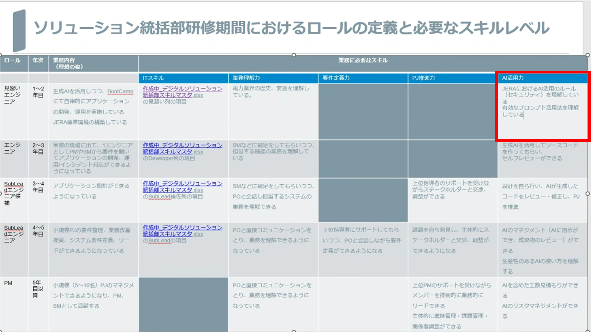
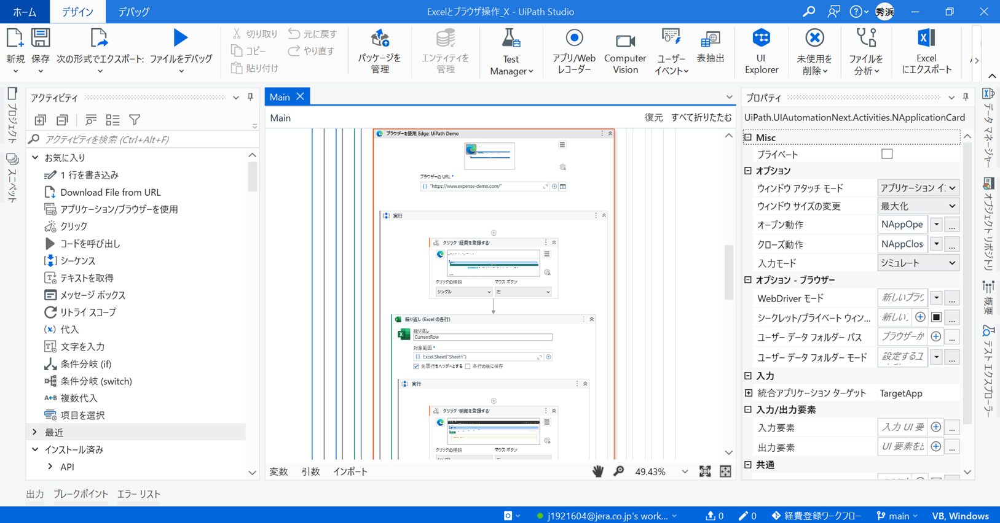
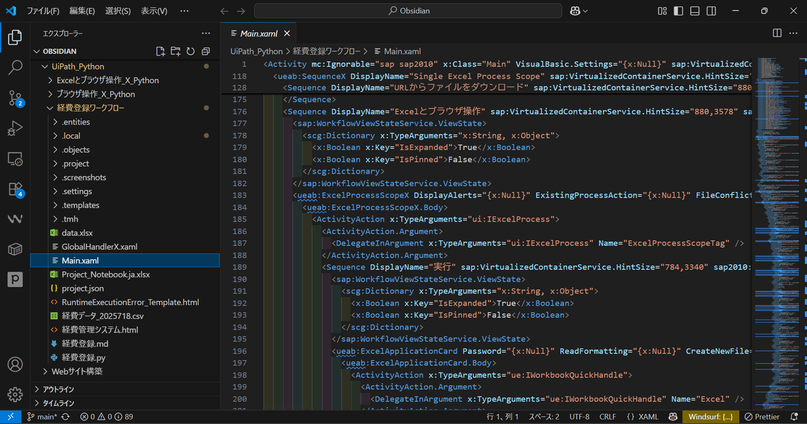
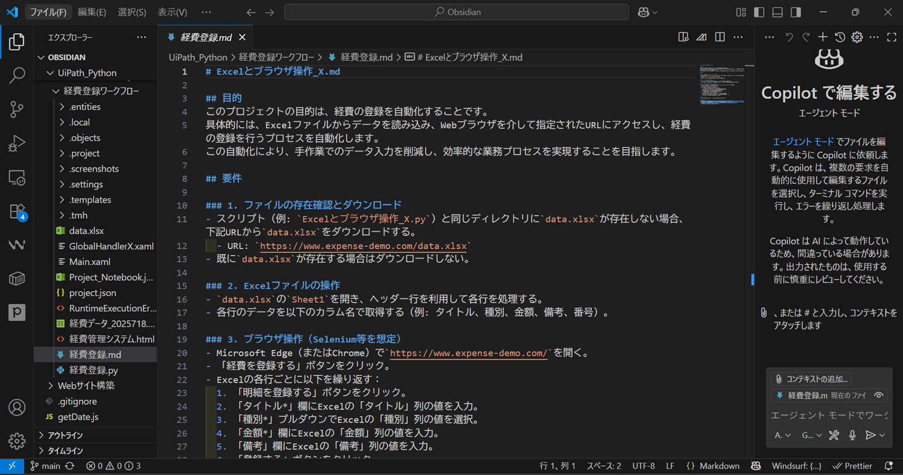
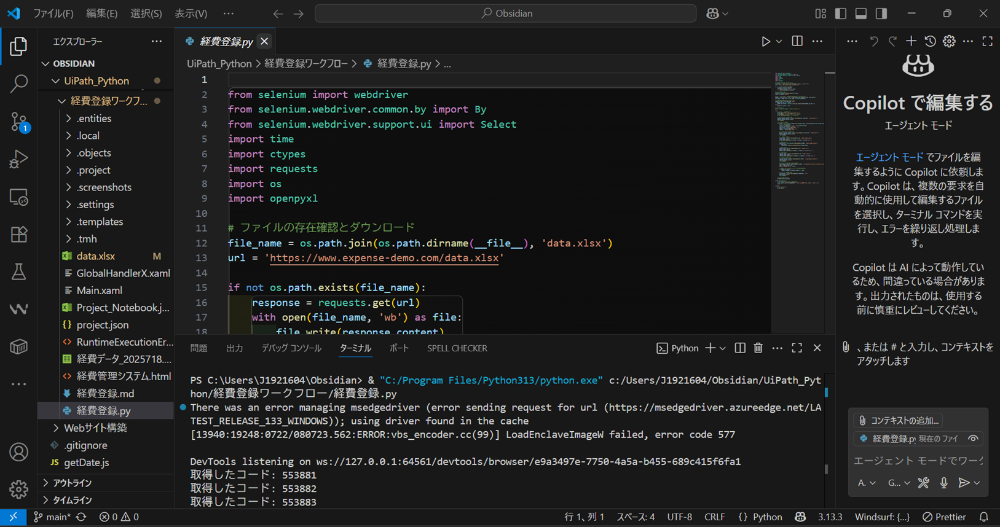
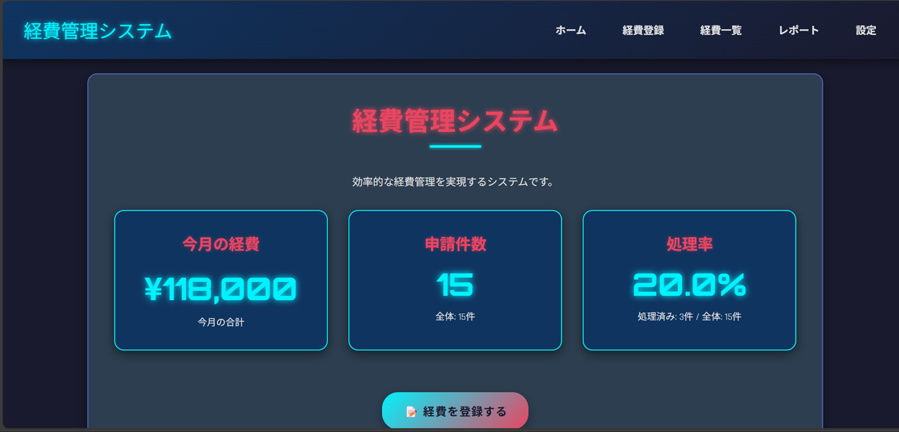

<!-- スライド1: タイトルスライド -->

# AI活用ローコード開発
#### 部門横断_人財育成・コーディング混成チーム

---

<!-- スライド2: 全体像 -->

AI活用の全体像

従来の開発プロセスを革新する5つのステップ

---
見習いエンジニア向け：AI活用ローコード開発を導入

---

<!-- スライド3: フェーズ1 -->

1. RPAワークフロー作成フェーズ

• ユーザー自身がローコード開発ツールを使用 
• 直感的なUIで業務ロジックを視覚化 
• RPAワークフロー.xamlとして保存・管理

---
UiPath_GUI：直感的なUIで業務ロジックを視覚化

---
UiPathワークフロー.xaml

---

<!-- スライド4: フェーズ2 -->

2. 設計書AI生成フェーズ

• AIがRPAワークフロー.xamlの内容を解析 
• 構造化されたマークダウン形式で設計書.mdを生成 
• 可読性が高く、保守性に優れた文書を作成

---
設計書.md：構造化されたマークダウン形式

---

<!-- スライド5: フェーズ3 -->

3. コードAI生成フェーズ

• 設計書.mdをベースにPythonコードを生成 
• 実行可能なワークフロー.pyファイルを作成 
• 高品質で保守性の高いコードを生成

---
Pythonワークフロー.py：実行可能

---

<!-- スライド6: フェーズ4 -->

4. WebアプリAI生成フェーズ

• 設計書.mdからシステム.htmlを生成 
• UIを含む完全なWebアプリを作成 
• レスポンシブデザインで様々なデバイスに対応

---
Webアプリ 経費管理システム.html

---

<!-- スライド7: フェーズ5 -->

5. プレゼン資料AI生成フェーズ

• 設計書.mdからスライド資料を作成 
• pdfやpptx形式で出力 
• 関係者への説明・共有に最適化された資料を生成

