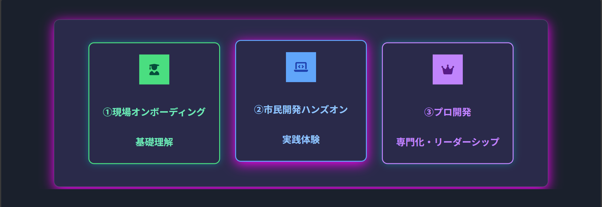
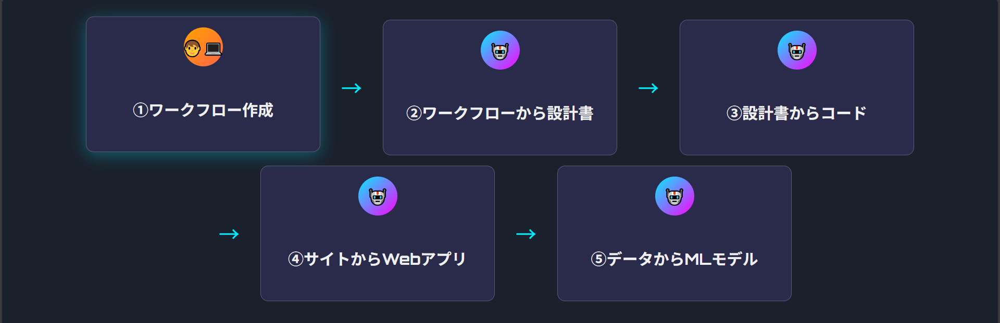

#### 【開発力強化】開発、保守案件の内製化に向けた育成計画策定

# AI教育コンテンツ作成

#### デジタルソリューション統括部
#### 部門横断課題　人材育成チーム
2025年10月2日​

---

<!-- _class: top-left -->

<!-- backgroundImage: url(./デジタル部門/デジタル部門_背景.jpg) -->

## 背景と意義

### 🌍背景

- 「AIの進化」が「働き方」を根本から刷新する歴史的な変革期

### 💎チャンス到来

- 市場価値の高い「AIドリブン人財」「ハイパフォーマー」になる

### 🔥意義

- 「スキル習得」が組織変革の起点

### ※学習する非エンジニアが、学習するAIを駆使して、 　学習しないプロを凌駕する時代

---

<!-- _class: top-left -->

## 3つの成⻑⽬標

### 🎯実践スキル習得

- AI×自動化ツール「操作スキル」
- 思考プロセス「言語化スキル」（コンテクスト構造化）
- コード「読解スキル」

### 🧠AIの特性と「限界」を理解

- 最適な「AIモデル選択」センス養成

### ⚡ハイパフォーマンス体験

- 劇的な生産性向上をAIで再現

---

<!-- _class: top-left -->

## ローコード市⺠開発の役割

### 「②市民開発」が、

### 「①現場オンボーディング」と「③プロ開発」を橋渡し

---

<!-- _class: top-left -->

## 5つの体験フロー

###### 「①ローコード開発」～「④アプリ開発」「⑤AIモデル構築」を100%内製

## 生産性の飛躍的インパクトを体感

---

<!-- _class: top-left -->

## 期待する成果

### ✨短期間で成果を実証

- AI補助で「非エンジニア」が圧倒的パフォーマンスを発揮

### ⚡スピードとクオリティを両⽴

- コード開発‧ドキュメント作成‧分析プロセスを高速化

#
#
### さらに「プロ開発者」も、

- 「豊富な経験知」と「AI機能」を融合、「コード品質」チェック
- #### ベンダー成果物レビュー・アプリ内製など模範事例を創出

---

<!-- _class: top-left -->

## 今後の展望

### 📈コンテンツ全社展開

- 非エンジニアから全社員へ
- ターゲット拡大（キャリア自律）

### 🤝部⾨コラボ強化

- DPPアプリ内製
- ML回帰分析モデル応用
  LNG･NH3タンク在庫、GT圧縮機フィルタ･脱硫M/E差圧を予測

### 🎯成功事例の共有

- AI×自動化ツール連携
- 市民開発ドキュメント自動生成：実用レベル（採用済！）

---

<!-- _class: lead -->

<!-- backgroundImage: url(./デジタル部門/デジタル部門_中扉.jpg) -->

### 2025年10月2日16時

# デジタル部門の新人が、

# 第一歩を踏み出しました！

## このビジョンに共感したら、即アクセス！

### https://jeragroup.sharepoint.com/sites/Jenny1/SitePages/AIモデル体感コース.aspx
