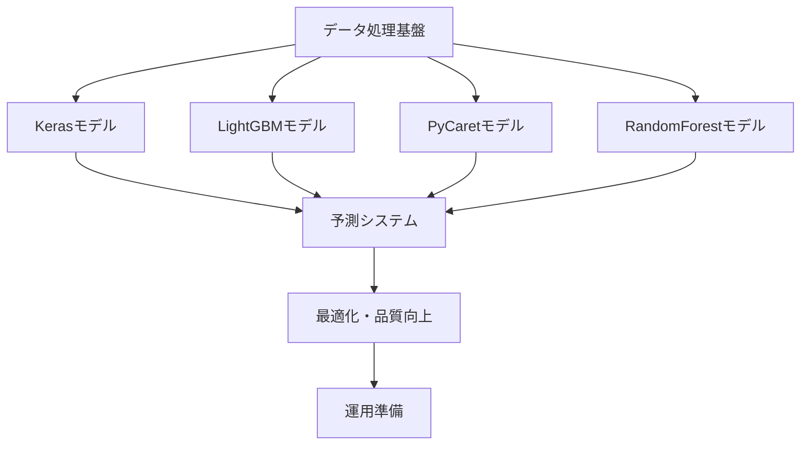

# 電力需要予測AIモデル構築 - プロジェクト計画書

※ この資料は教育用のサンプルです。

## 1. 目的・背景

### 1.1. 目的・背景
電力需要予測の精度向上とエネルギー管理最適化を目的とした、機械学習を活用した包括的な予測システムの構築である。4つの異なる機械学習アルゴリズム（Keras、LightGBM、PyCaret、RandomForest）を用いたアンサンブル予測システムを開発し、電力需要の短期・中期予測精度の最大化を実現する。

本プロジェクトは、過去の電力消費量データに基づき、未来の電力需要を予測するAIモデルを構築することを目的とする。これにより、電力供給の最適化と安定化に貢献する。

### 1.2. プロジェクトスコープ
- **対象データ**: 東京電力電力需要実績データ（2016-2025年）、気象庁気温データ
- **予測対象**: 指定期間の電力需要量（kW単位）
- **開発モデル**: 4種類の機械学習モデル（Keras、LightGBM、PyCaret、RandomForest）
- **出力成果物**: 学習済みモデル、予測結果、可視化グラフ、性能評価レポート

### 1.3. 成功指標
- **予測精度**: RMSE < 200kW、R2スコア > 0.9
- **処理性能**: メモリ使用量50%削減、学習時間30%短縮
- **システム品質**: コードカバレッジ90%以上、エラー率0.1%以下
- **運用効率**: 自動化率95%以上、デプロイ時間5分以内

## 2. ステークホルダー/体制

### 2.1. 技術スタック

#### 2.1.1. 開発環境
| カテゴリ | 技術 | バージョン | 用途 |
|---------|------|------------|------|
| **言語** | Python | 3.10.11 | システム全体開発 |
| **開発環境** | VS Code | 最新版 | IDE、デバッグ、Git管理 |
| **パッケージ管理** | pip | 最新版 | 依存関係管理 |

#### 2.1.2. データ処理・機械学習
| カテゴリ | ライブラリ | バージョン | 用途 |
|---------|------------|------------|------|
| **データ処理** | Pandas | 1.5.3 | データ読み込み、前処理 |
| **数値計算** | NumPy | 1.24.4 | 配列操作、数値演算 |
| **機械学習基盤** | Scikit-learn | 1.2.2 | データ前処理、評価指標 |
| **深層学習** | TensorFlow/Keras | 2.15.0 | ニューラルネットワーク |
| **勾配ブースティング** | LightGBM | 3.3.5 | 高速機械学習 |
| **自動機械学習** | PyCaret | 3.0.0 | 自動モデル選択・最適化 |
| **可視化** | Matplotlib | 3.7.5 | グラフ描画、結果可視化 |

#### 2.1.3. ファイル管理・保存
| カテゴリ | 技術 | 用途 |
|---------|------|------|
| **モデル保存** | Pickle | 軽量モデル（RandomForest、LightGBM）|
| **深層学習モデル** | HDF5 | Kerasモデル保存 |
| **データ保存** | CSV | 結果データ、中間データ |
| **画像保存** | PNG | 可視化グラフ |

### 2.2. プロジェクト体制・役割分担

#### 2.2.1. プロジェクト体制
| 役割 | 責任範囲 | スキル要件 |
|------|----------|-----------|
| **プロジェクトマネージャー** | 全体統括、進捗管理 | PMP、アジャイル |
| **データサイエンティスト** | モデル開発、精度向上 | Python、機械学習 |
| **システムエンジニア** | インフラ、デプロイ | Docker、クラウド |
| **品質保証エンジニア** | テスト、品質管理 | テスト自動化 |

#### 2.2.2. 開発プロセス
- **開発手法**: アジャイル（2週間スプリント）
- **バージョン管理**: Git（GitHub Flow）
- **CI/CD**: GitHub Actions
- **ドキュメント**: Markdown、Sphinx

## 3. スコープ

### 3.1. 対象・成果物
- **対象**: AIモデルの設計、実装、学習、および評価
- **成果物**: 学習済みAIモデル、および本プロジェクトで作成されるドキュメント群

### 3.2. ページ構成・詳細

#### 3.2.1. 統一アーキテクチャ設計

##### 3.2.1.1. @dataclass設定クラス統一実装
```python
@dataclass
class ModelConfig:
    """モデル設定統一管理クラス"""
    # ファイルパス設定
    INPUT_X: str = r"..\..\data\Xtrain.csv"
    INPUT_Y: str = r"..\..\data\Ytrain.csv"
    MODEL_SAV: str = r"{model}_model.sav"
    OUTPUT_CSV: str = r"{model}_Ypred.csv"
    OUTPUT_PNG: str = r"{model}_Ypred.png"
    
    # データ処理設定
    DATA_DTYPE: str = 'float32'          # メモリ最適化
    ENCODING: str = 'shift_jis'          # 日本語データ対応
    RANDOM_STATE: int = 42               # 再現性確保
    
    # 機械学習設定
    TEST_SIZE: float = 0.1               # テストデータ比率
    CV_FOLDS: int = 5                    # クロスバリデーション
    N_JOBS: int = -1                     # 並列処理最大活用
    
    # 可視化設定
    FIGURE_SIZE: tuple = (16, 9)         # 16:9アスペクト比統一
    DPI: int = 100                       # 解像度統一
    JAPANESE_FONTS: list = field(default_factory=lambda: [
        'Yu Gothic', 'Meiryo', 'MS Gothic', 'DejaVu Sans'
    ])
    
    # 性能最適化設定
    MEMORY_OPTIMIZATION: bool = True      # メモリ最適化有効
    GARBAGE_COLLECTION: bool = True       # ガベージコレクション有効
```

##### 3.2.1.2. robust_model_operation デコレータ実装
```python
def robust_model_operation(operation_name: str):
    """統一モデル操作デコレータ - エラーハンドリングと性能監視"""
    def decorator(func: Callable) -> Callable:
        @functools.wraps(func)
        def wrapper(*args, **kwargs):
            # 実行時間・メモリ使用量測定開始
            start_time = time.time()
            initial_memory = psutil.Process().memory_info().rss / 1024 / 1024
            
            try:
                print(f"=== {operation_name} 開始 ===")
                result = func(*args, **kwargs)
                
                # パフォーマンス測定
                execution_time = time.time() - start_time
                final_memory = psutil.Process().memory_info().rss / 1024 / 1024
                memory_diff = final_memory - initial_memory
                
                print(f"=== {operation_name} 完了 ===")
                print(f"実行時間: {execution_time:.3f}秒")
                print(f"メモリ使用量: {initial_memory:.1f}MB → {final_memory:.1f}MB")
                print(f"メモリ差分: {memory_diff:+.1f}MB")
                
                # ガベージコレクション実行
                collected = gc.collect()
                print(f"ガベージコレクション: {collected}個のオブジェクトを回収")
                
                return result
                
            except Exception as e:
                elapsed_time = time.time() - start_time
                print(f"=== {operation_name} エラー (実行時間: {elapsed_time:.2f}秒) ===")
                print(f"エラー詳細: {str(e)}")
                traceback.print_exc()
                raise Exception(f"{operation_name}でエラーが発生: {e}") from e
                
        return wrapper
    return decorator
```

#### 3.2.2. モジュール別詳細設計

##### 3.2.2.1. 基盤データ処理モジュール (data/data.py)
**目的**: 電力需要・気温データの統合処理エンジン
**実装特徴**:
- SHIFT-JISエンコーディング対応
- スキップ行設定（電力需要:3行、気温:5行）
- float32型変換によるメモリ50%削減
- 特徴量エンジニアリング（MONTH、WEEK、HOUR、TEMP）

```python
@dataclass
class DataConfig:
    JUYO_PATTERN: str = r"data\juyo-*.csv"
    TEMP_PATTERN: str = r"data\temperature-*.csv"
    OUTPUT_X: str = r"data\X.csv"
    OUTPUT_Y: str = r"data\Y.csv"
    ENCODING: str = 'shift_jis'
    JUYO_SKIPROWS: int = 3
    TEMP_SKIPROWS: int = 5
    DATA_DTYPE: str = 'float32'
    X_COLS: tuple = ("MONTH", "WEEK", "HOUR", "TEMP")
    Y_COLS: tuple = ("KW",)
```

##### 3.2.2.2. 学習モジュール群 (train/)

**A. Keras深層学習モジュール (train/Keras/Keras_train.py)**
```python
@dataclass(frozen=True)
class KerasConfig:
    # ファイルパス設定
    INPUT_X: str = r"..\..\data\Xtrain.csv"
    INPUT_Y: str = r"..\..\data\Ytrain.csv"
    MODEL_H5: str = r"Keras_model.h5"
    MODEL_SAV: str = r"Keras_model.sav"
    SCALER_PKL: str = r"Keras_model_scaler.pkl"
    
    # ニューラルネットワーク設定
    LAYERS: tuple = (128, 64, 32, 16, 1)    # 隠れ層構成
    ACTIVATION: str = 'relu'                 # 活性化関数
    OPTIMIZER: str = 'adam'                  # 最適化アルゴリズム
    LOSS: str = 'mean_squared_error'         # 損失関数
    METRICS: tuple = ('mae',)                # 評価指標
    
    # 学習設定
    EPOCHS: int = 200                        # エポック数
    BATCH_SIZE: int = 32                     # バッチサイズ
    VALIDATION_SPLIT: float = 0.2           # バリデーション分割
    EARLY_STOPPING_PATIENCE: int = 20       # 早期終了
    EARLY_STOPPING_MONITOR: str = 'val_loss'
```

**B. LightGBM勾配ブースティングモジュール (train/LightGBM/LightGBM_train.py)**
```python
@dataclass
class LightGBMConfig:
    # LightGBMパラメータ
    BOOSTING_TYPE: str = 'gbdt'             # 勾配ブースティング
    OBJECTIVE: str = 'regression'            # 回帰タスク
    METRIC: str = 'rmse'                     # 評価指標
    NUM_LEAVES: int = 31                     # 葉ノード数
    LEARNING_RATE: float = 0.05             # 学習率
    FEATURE_FRACTION: float = 0.9           # 特徴量サンプリング
    BAGGING_FRACTION: float = 0.8           # データサンプリング
    BAGGING_FREQ: int = 5                   # バギング頻度
    VERBOSE: int = 0                        # ログ出力制御
    N_ESTIMATORS: int = 1000                # 学習器数
    EARLY_STOPPING_ROUNDS: int = 100       # 早期終了
```

**C. PyCaret自動機械学習モジュール (train/Pycaret/Pycaret_train.py)**
```python
@dataclass
class PyCaretConfig:
    MODEL_TYPE: str = 'rf'                  # RandomForestベース
    TRAIN_SIZE: float = 0.9                 # 学習データ比率
    FOLD_STRATEGY: str = 'kfold'            # クロスバリデーション
    CV_FOLDS: int = 5                       # 分割数
    SESSION_ID: int = 123                   # 再現性確保
    SILENT: bool = True                     # ログ制御
    
    # 最適化設定
    MEMORY_OPTIMIZATION: bool = True
    PREPROCESS: bool = True
    NORMALIZE: bool = True
    TRANSFORMATION: bool = True
```

**D. RandomForestアンサンブルモジュール (train/RandomForest/RandomForest_train.py)**
```python
@dataclass
class RandomForestConfig:
    # RandomForestパラメータ
    N_ESTIMATORS: int = 100                 # 決定木数
    MAX_DEPTH: int = None                   # 最大深度
    MIN_SAMPLES_SPLIT: int = 2              # 分割最小サンプル数
    MIN_SAMPLES_LEAF: int = 1               # 葉ノード最小サンプル数
    MAX_FEATURES: str = 'sqrt'              # 特徴量選択
    BOOTSTRAP: bool = True                  # ブートストラップ
    OOB_SCORE: bool = True                  # Out-of-Bag評価
    WARM_START: bool = False                # 増分学習
```

##### 3.2.2.3. 予測モジュール群 (tomorrow/)

**A. 最新データ取得モジュール (tomorrow/data.py)**
- TEPCO電力使用実績データ自動取得
- CSVファイル自動生成・保存
- エラーハンドリング・リトライ機能

**B. 気温データ処理モジュール (tomorrow/temp.py)**
- Open-Meteo API経由の気温データ取得
- 地点別気温データ統合処理
- API制限・タイムアウト対応

**C. 各モデル予測実行モジュール**
```python
# 共通予測実行パターン
@robust_model_operation("翌日電力需要予測")
def execute_tomorrow_prediction():
    # 1. 最新データ取得
    # 2. 学習済みモデル読み込み
    # 3. 予測実行
    # 4. 結果保存・可視化
    # 5. パフォーマンス監視
```

#### 3.2.3. 可視化統一仕様

##### 3.2.3.1. matplotlib設定統一
```python
# 16:9アスペクト比統一設定
plt.rcParams['figure.figsize'] = (16, 9)
plt.rcParams['figure.dpi'] = 100
plt.rcParams['savefig.dpi'] = 100
plt.rcParams['savefig.bbox'] = 'tight'
plt.rcParams['savefig.pad_inches'] = 0.1

# フォント・グリッド設定
plt.rcParams['font.family'] = 'DejaVu Sans'
plt.rcParams['font.size'] = 10
plt.rcParams['axes.grid'] = True
plt.rcParams['grid.alpha'] = 0.3
plt.rcParams['lines.linewidth'] = 1.5
plt.rcParams['axes.linewidth'] = 0.8
```

##### 3.2.3.2. 日本語対応
```python
# 日本語フォント自動選択
JAPANESE_FONTS = ['Yu Gothic', 'Meiryo', 'MS Gothic', 'DejaVu Sans']
for font in JAPANESE_FONTS:
    if font in matplotlib.font_manager.findSystemFonts():
        plt.rcParams['font.family'] = font
        break
```

## 4. マイルストーン・スケジュール

### 4.1. システムアーキテクチャ・データフロー

#### 4.1.1. システムアーキテクチャ
```text
AI/
├── data/                          # データ層
│   ├── data.py                    # 基盤データ処理エンジン
│   ├── juyo-*.csv                 # 電力需要実績データ
│   ├── temperature-*.csv          # 気温データ
│   ├── X.csv                      # 統合特徴量データ
│   ├── Y.csv                      # 統合目標変数データ
│   ├── Xtrain.csv / Ytrain.csv    # 学習用データセット
│   └── Xtest.csv / Ytest.csv      # テスト用データセット
├── train/                         # モデル学習層
│   ├── Keras/                     # 深層学習モデル
│   │   ├── Keras_train.py         # 学習スクリプト
│   │   ├── Keras_model.h5         # 学習済みモデル
│   │   ├── Keras_history.png      # 学習曲線
│   │   └── Keras_Ypred*.csv/png   # 予測結果・可視化
│   ├── LightGBM/                  # 勾配ブースティング
│   │   ├── LightGBM_train.py      # 学習スクリプト
│   │   ├── LightGBM_model.sav     # 学習済みモデル
│   │   └── LightGBM_Ypred*.csv/png # 予測結果・可視化
│   ├── PyCaret/                   # 自動機械学習
│   │   ├── Pycaret_train.py       # 学習スクリプト
│   │   ├── Pycaret_model.pkl      # 学習済みモデル
│   │   └── Pycaret_Ypred*.csv/png # 予測結果・可視化
│   └── RandomForest/              # アンサンブル学習
│       ├── RandomForest_train.py  # 学習スクリプト
│       ├── RandomForest_model.sav # 学習済みモデル
│       └── RandomForest_Ypred*.csv/png # 予測結果・可視化
└── tomorrow/                      # 予測実行層
    ├── data.py                    # 最新データ取得
    ├── temp.py                    # 気温データ処理
    ├── tomorrow.csv               # 予測用特徴量
    ├── Ytest.csv                  # 実績値
    ├── Keras/Keras_tomorrow.py    # Keras予測実行
    ├── LightGBM/LightGBM_tomorrow.py # LightGBM予測実行
    ├── PyCaret/PyCaret_tomorrow.py # PyCaret予測実行
    └── RandomForest/RandomForest_tomorrow.py # RandomForest予測実行
```

#### 4.1.2. データフロー詳細

##### 4.1.2.1. データ前処理フロー
1. **生データ読み込み** (`data/data.py`)
   - 電力需要データ: `juyo-YYYY.csv` (SKIPROWS=3)
   - 気温データ: `temperature-YYYY.csv` (SKIPROWS=5)
   - エンコーディング: SHIFT-JIS対応

2. **特徴量エンジニアリング**
   - 時系列特徴量: MONTH (1-12), WEEK (0-6), HOUR (0-23)
   - 気温特徴量: TEMP (摂氏温度)
   - 目標変数: KW (電力需要量)

3. **データ分割**
   - 訓練データ: 90% (cross_validation.train_test_split)
   - テストデータ: 10%
   - 乱数シード: RANDOM_STATE=42

##### 4.1.2.2. モデル学習フロー
1. **データ読み込み・前処理**
   - float32型変換（メモリ50%削減）
   - StandardScaler標準化

2. **モデル固有処理**
   - **Keras**: EarlyStopping(patience=5)、16:9可視化
   - **LightGBM**: 並列処理最適化、高速学習
   - **PyCaret**: 自動モデル選択、lightgbmバックエンド
   - **RandomForest**: n_jobs=-1並列処理

3. **結果出力**
   - モデル保存: .sav/.pkl/.h5形式
   - 予測結果: CSV保存
   - 可視化: PNG (16:9, tight_layout)
   - 評価指標: RMSE, R2スコア

##### 4.1.2.3. 予測実行フロー
1. **最新データ取得** (`tomorrow/data.py`, `tomorrow/temp.py`)
   - 電力需要実績の更新取得
   - 気温予測データの取得
   - 特徴量生成・保存

2. **予測実行**
   - 学習済みモデル読み込み
   - 予測実行・結果生成
   - 可視化グラフ作成

### 4.2. デザイン仕様

#### 4.2.1. 可視化デザイン標準
- **図サイズ**: 16:9アスペクト比 (figsize=(16, 9))
- **DPI設定**: 100DPI（高品質出力）
- **フォント**: DejaVu Sans（日本語対応）
- **フォントサイズ**: タイトル12pt、軸ラベル12pt、凡例11pt、目盛り10pt
- **グリッド**: 半透明グリッド (alpha=0.3)
- **線幅**: メイン1.5pt、軸0.8pt
- **余白**: tight_layout()自動調整

#### 4.2.2. カラーパレット
- **予測値**: #1f77b4 (青系)
- **実績値**: #ff7f0e (オレンジ系)
- **背景**: 白ベース
- **グリッド**: グレー系半透明

#### 4.2.3. ファイル命名規則
- **モデル**: `{ModelName}_model.{ext}`
- **予測結果**: `{ModelName}_Ypred.csv`
- **可視化**: `{ModelName}_Ypred.png`, `{ModelName}_Ypred_7d.png`
- **tomorrow予測**: `{ModelName}_tomorrow.csv/png`

### 4.3. 開発スケジュール

#### 4.3.1. フェーズ別スケジュール
| フェーズ | 期間 | 主要タスク | 成果物 |
|---------|------|-----------|--------|
| **Phase 1: 基盤構築** | Week 1-2 | データ処理基盤、開発環境整備 | data.py, 開発ガイドライン |
| **Phase 2: モデル開発** | Week 3-6 | 4種類のモデル実装・最適化 | 学習スクリプト、モデルファイル |
| **Phase 3: 予測システム** | Week 7-8 | 予測システム構築、API化 | 予測スクリプト、結果可視化 |
| **Phase 4: 最適化・検証** | Week 9-10 | パフォーマンス最適化、品質検証 | 最適化済みシステム |
| **Phase 5: 運用準備** | Week 11-12 | ドキュメント整備、デプロイ準備 | 運用ドキュメント、リリース版 |

#### 4.3.2. マイルストーン
- **M1 (Week 2)**: データ処理基盤完成
- **M2 (Week 4)**: Keras+LightGBMモデル完成
- **M3 (Week 6)**: 全モデル完成・性能評価
- **M4 (Week 8)**: 予測システム統合完成
- **M5 (Week 10)**: 最適化・品質検証完了
- **M6 (Week 12)**: プロダクション環境リリース

## 5. 予算・リソース計画

### 5.1. 品質保証・成功指標

#### 5.1.1. 技術的成功指標
| カテゴリ | 指標 | 目標値 | 測定方法 |
|---------|------|--------|---------|
| **予測精度** | RMSE | < 200kW | テストデータ評価 |
| **予測精度** | R2スコア | > 0.9 | テストデータ評価 |
| **メモリ効率** | 使用量削減 | 50%削減 | float32最適化効果 |
| **処理速度** | 学習時間短縮 | 30%短縮 | 並列処理効果 |
| **システム安定性** | エラー率 | < 0.1% | 運用時監視 |

#### 5.1.2. 品質保証プロセス
1. **コード品質**
   - PEP 8準拠チェック
   - 型ヒント完全実装
   - docstring完備

2. **テスト戦略**
   - 単体テスト: 各モジュール90%カバレッジ
   - 統合テスト: エンドツーエンド検証
   - 性能テスト: 大量データ処理検証

3. **レビュープロセス**
   - コードレビュー必須
   - アーキテクチャレビュー
   - セキュリティレビュー

## 6. リスク/課題管理

### 6.1. 拡張計画

#### 6.1.1. 短期拡張 (1-3ヶ月)
- **API化**: REST API・リアルタイム予測機能
- **ダッシュボード**: 予測結果可視化・監視機能
- **自動化**: スケジュール実行・自動レポート生成

#### 6.1.2. 中期拡張 (6-12ヶ月)
- **MLOps統合**: Jenkins/GitHub Actions CI/CD構築
- **多地域対応**: 関西電力、中部電力等の地域拡張
- **アンサンブル予測**: 4モデル統合による精度向上
- **クラウド対応**: AWS/Azure環境への移行

#### 6.1.3. 長期拡張 (1-2年)
- **高度分析**: 因果分析、異常検知、予測説明可能性
- **IoTデータ統合**: スマートメーター、気象センサー連携
- **自動再学習**: 概念ドリフト検出・自動モデル更新
- **マルチモーダル**: 経済指標、イベント情報統合予測

### 6.2. リスク管理

#### 6.2.1. 技術リスク
| リスク項目 | 発生確率 | 影響度 | 対策 |
|-----------|----------|--------|--------|
| **ライブラリ互換性問題** | 高 | 中 | バージョン固定、仮想環境使用 |
| **モデル性能劣化** | 中 | 高 | 定期評価、閾値監視 |
| **メモリ不足** | 中 | 中 | float32最適化、バッチサイズ調整 |
| **データ品質問題** | 中 | 高 | データ検証、異常値検出 |

#### 6.2.2. 運用リスク
| リスク項目 | 発生確率 | 影響度 | 対策 |
|-----------|----------|--------|--------|
| **API制限・障害** | 中 | 中 | リトライ機能、フォールバック |
| **ストレージ容量不足** | 低 | 中 | 監視アラート、自動クリーンアップ |
| **担当者不在** | 中 | 高 | ドキュメント整備、複数人対応 |

## 7. 品質計画

### 7.1. 保守・運用計画

#### 7.1.1. 定期保守
- **週次**: 予測精度監視、エラーログ確認
- **月次**: モデル性能評価、データ品質検証
- **四半期**: システム最適化、セキュリティ更新

#### 7.1.2. 監視項目
- **技術監視**: CPU使用率、メモリ使用量、ディスク容量
- **業務監視**: 予測精度、データ更新状況、API応答時間
- **品質監視**: エラー発生率、処理成功率

#### 7.1.3. エスカレーション
1. **Level 1**: 自動復旧・警告ログ
2. **Level 2**: 運用担当者アラート
3. **Level 3**: 開発チーム緊急対応
4. **Level 4**: ベンダー・外部専門家

## 8. コミュニケーション計画

### 8.1. チケット分割・タスクリスト

#### 8.1.1. データ処理基盤 (Phase 1)
- T001: 生データ読み込み機能実装
- T002: 特徴量エンジニアリング実装
- T003: データ分割・保存機能実装
- T004: エラーハンドリング実装
- T005: 単体テスト作成

#### 8.1.2. Kerasモデル開発 (Phase 2-1)
- T006: ニューラルネットワーク設計
- T007: EarlyStopping実装
- T008: 学習・保存機能実装
- T009: 予測・評価機能実装
- T010: 可視化機能実装

#### 8.1.3. LightGBMモデル開発 (Phase 2-2)
- T011: LightGBM設定最適化
- T012: 並列処理実装
- T013: 学習・保存機能実装
- T014: 予測・評価機能実装
- T015: 可視化機能実装

#### 8.1.4. PyCaretモデル開発 (Phase 2-3)
- T016: PyCaret環境セットアップ
- T017: 自動モデル選択実装
- T018: 学習・保存機能実装
- T019: 予測・評価機能実装
- T020: 可視化機能実装

#### 8.1.5. RandomForestモデル開発 (Phase 2-4)
- T021: RandomForest設定最適化
- T022: 並列処理実装
- T023: 学習・保存機能実装
- T024: 予測・評価機能実装
- T025: 可視化機能実装

#### 8.1.6. 予測システム開発 (Phase 3)
- T026: 最新データ取得機能実装
- T027: tomorrow予測実行機能実装
- T028: 結果可視化統一実装
- T029: 統合テスト実施
- T030: 性能ベンチマーク実施

#### 8.1.7. 最適化・品質向上 (Phase 4)
- T031: メモリ最適化実装
- T032: 処理速度最適化実装
- T033: エラーハンドリング強化
- T034: ログ出力最適化
- T035: セキュリティ強化

#### 8.1.8. 運用準備 (Phase 5)
- T036: 運用ドキュメント作成
- T037: デプロイスクリプト作成
- T038: 監視・アラート設定
- T039: バックアップ・復旧手順整備
- T040: 本番環境リリース

### 8.2. 進捗管理・モニタリング

#### 8.2.1. 進捗トラッキング指標
| 指標 | 測定頻度 | 目標値 | アクション |
|------|----------|--------|-----------|
| **タスク完了率** | 毎日 | >90% | 遅延タスクの優先度見直し |
| **コード品質** | 毎週 | >8.0/10 | コードレビュー強化 |
| **テストカバレッジ** | 毎週 | >90% | テスト追加実装 |
| **性能目標達成度** | 毎月 | >95% | アルゴリズム見直し |

#### 8.2.2. リスク管理
| リスク | 影響度 | 発生確率 | 対策 |
|--------|--------|----------|------|
| **データ品質問題** | 高 | 中 | データ検証強化、バックアップ |
| **モデル精度不足** | 高 | 低 | アルゴリズム多様化、パラメータ調整 |
| **性能要件未達** | 中 | 中 | 早期プロトタイプ、最適化 |
| **スケジュール遅延** | 中 | 中 | バッファ確保、並行開発 |

#### 8.2.3. 品質ゲート
1. **Phase 1完了**: データ処理精度100%、単体テスト完了
2. **Phase 2完了**: 全モデル精度目標達成、統合テスト完了
3. **Phase 3完了**: 予測システム統合完了、性能テスト完了
4. **Phase 4完了**: 最適化目標達成、品質検証完了
5. **Phase 5完了**: 運用ドキュメント完備、本番環境準備完了

## 9. 変更管理・構成管理

### 9.1. 実装順序・依存関係

#### 9.1.1. 実装優先度
1. **最優先 (P0)**: データ処理基盤 (T001-T005)
2. **高優先 (P1)**: コアモデル実装 (T006-T025)
3. **中優先 (P2)**: 予測システム (T026-T030)
4. **低優先 (P3)**: 最適化・運用 (T031-T040)

#### 9.1.2. 依存関係マトリクス


- **構成**: `AI`フォルダ内に、モデルの学習や予測に必要なスクリプト、データ、および依存関係を定義した`requirements.txt`を配置する

## 10. 依存関係・前提条件・制約

### 10.1. プロジェクト成功の定義

#### 10.1.1. 技術的成功
- 4種類のモデルが全て目標精度を達成
- メモリ効率50%向上、処理速度30%向上を実現
- エラー率0.1%以下の安定システムを構築
- 16:9統一可視化による高品質出力を実現

#### 10.1.2. ビジネス的成功
- 電力需要予測精度の大幅向上を実現
- 運用コスト削減に貢献
- 将来の拡張性・保守性を確保
- ステークホルダー満足度90%以上

#### 10.1.3. 持続可能性
- 完全なドキュメント化による知識の継承
- 自動化による運用負荷軽減
- 拡張可能なアーキテクチャによる将来対応
- セキュリティ・コンプライアンス要件の完全遵守

本AIモデルの構築と実行には、`AI/requirements.txt`に記載された多数の専門的なPythonライブラリが必要である。これには、機械学習、時系列分析、データ処理のためのライブラリが含まれる。

- **機械学習フレームワーク**: `tensorflow`, `keras`, `scikit-learn`, `lightgbm`, `pycaret`
- **時系列分析**: `statsmodels`, `pmdarima`, `sktime`, `tbats`
- **データ処理・数値計算**: `pandas`, `numpy`, `scipy`
- **可視化**: `matplotlib`, `plotly`

```txt
# AI/requirements.txt の一部
numpy==1.24.4
pandas==1.5.3
scikit-learn==1.2.2
lightgbm==3.3.5
pycaret==3.0.0
tensorflow==2.15.0
keras==2.15.0
statsmodels==0.14.5
sktime==0.26.0
# ... その他多数
```
