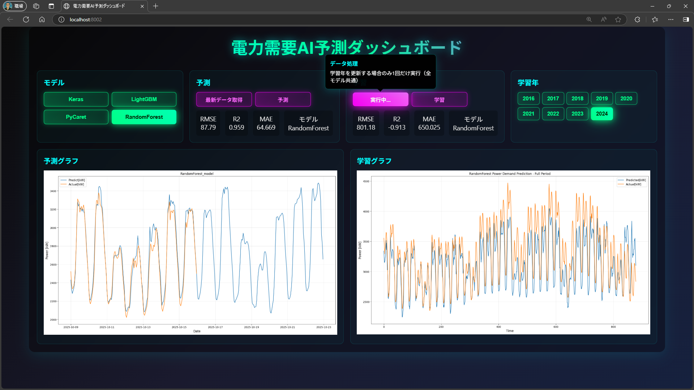
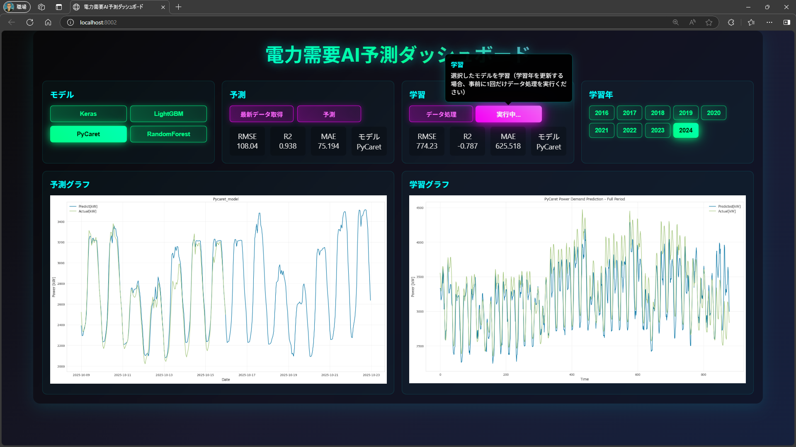
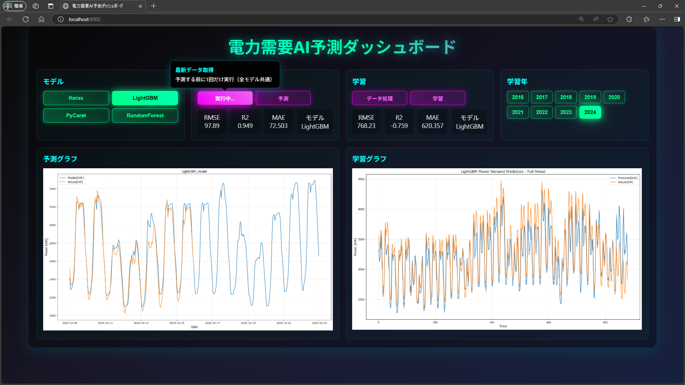
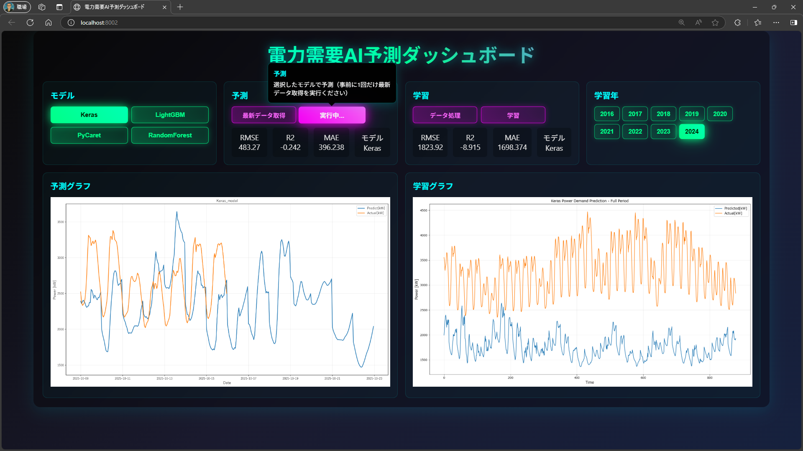

<section class="top-center">
    <h2>学習年「2024」全モデル共通「学習データ処理」実行中</h2>
    <!-- 余白なしでスライド幅いっぱいに表示 -->
    
</section>

---
<section class="top-center">
    <h2>学習年「2024」モデルPyCaret「学習」実行中</h2>
    <!-- 余白なしでスライド幅いっぱいに表示 -->
    
</section>

---
<section class="top-center">
    <h2>全モデル共通「予測データ取得」実行中</h2>
    <!-- 余白なしでスライド幅いっぱいに表示 -->
    
</section>

---
<section class="top-center">
    <h2>モデルKeras「予測」実行中　⇒　精度悪化の要因分析</h2>
    <!-- 余白なしでスライド幅いっぱいに表示 -->
    
</section>
