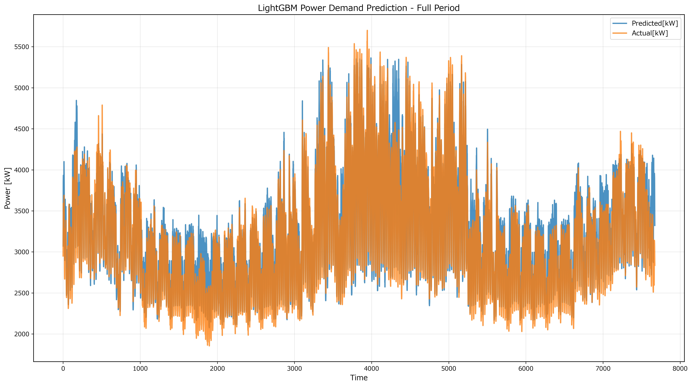
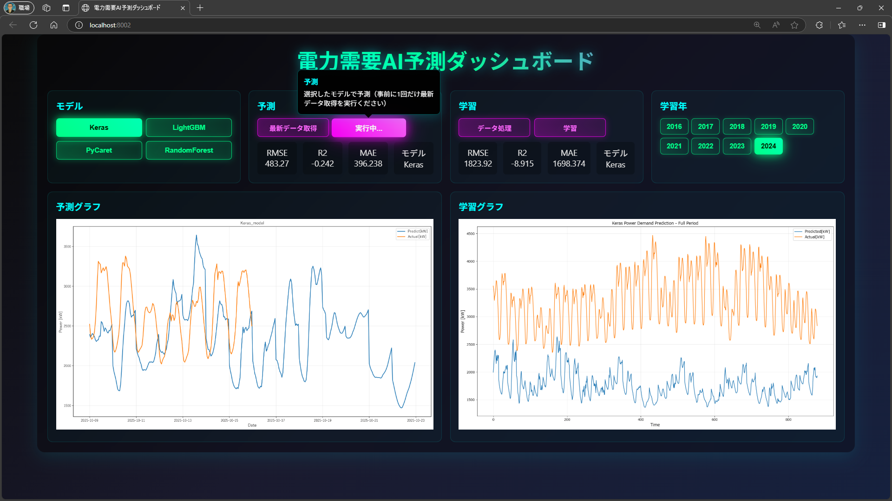
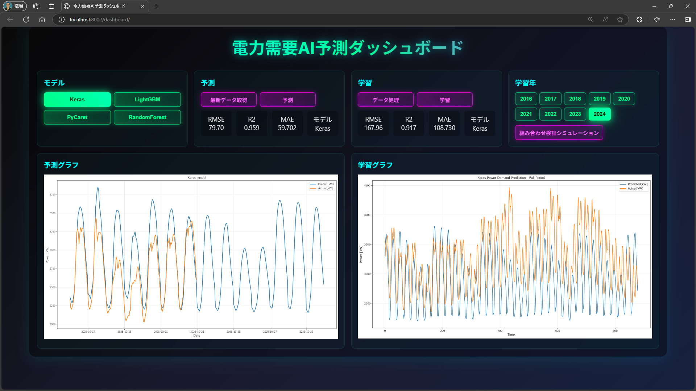
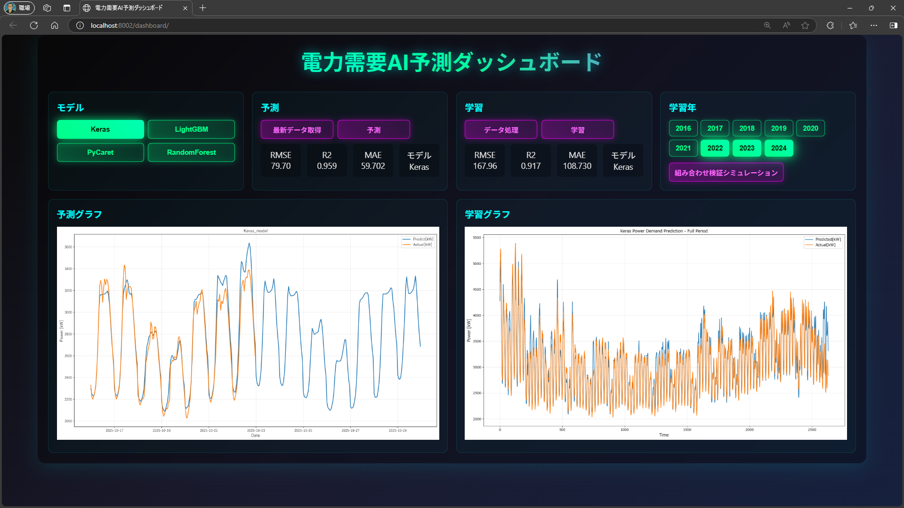

<section class="top-center">
    <h2>学習年「2016-2024」9年で変動大 ⇒ 分割で精度向上？</h2>
    <!-- 余白なしでスライド幅いっぱいに表示 -->
    
</section>

---
<section class="top-center">
    <h2>学習年「2024」モデルKeras（単年で精度悪化）</h2>
    <!-- 余白なしでスライド幅いっぱいに表示 -->
    
</section>

---
<section class="top-center">
    <h2>学習年「2024」モデルKeras（チューニングで精度向上）</h2>
    <!-- 余白なしでスライド幅いっぱいに表示 -->
    
</section>

---
<section class="top-center">
    <h2>学習年「2022-2024」モデルKeras（3年で劇的向上）</h2>
    <!-- 余白なしでスライド幅いっぱいに表示 -->
    
</section>
